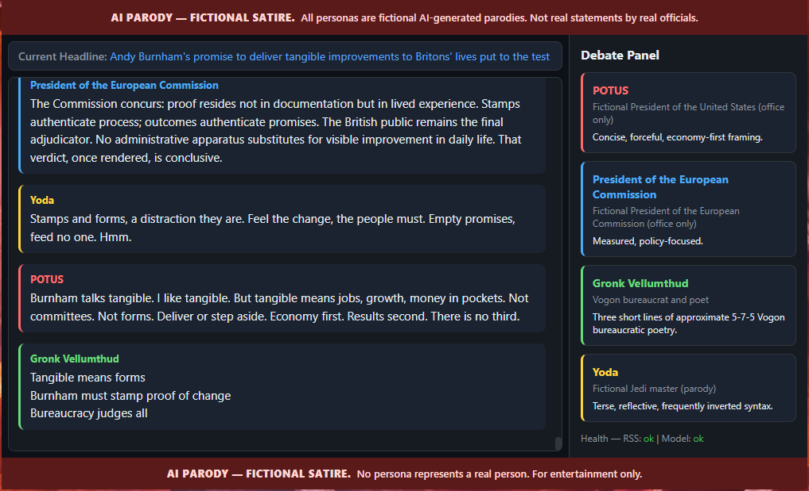

# Live News Debate Wall

**A wall-mounted argument that never ends.** Point a spare monitor at it and four AI parodies — an American president, a European Commission president, a Vogon bureaucrat who only speaks in haiku, and a certain small green Jedi — will bicker about real business headlines, forever, one short message at a time.

It pulls live stories from the France 24 Business RSS feed, gives each headline eight to twelve turns of debate, then moves on to the next one. It remembers what has already been said so nobody repeats themselves. It survives the feed going down, the model going down, and being killed mid-sentence. It is one Python file's worth of dependencies and no web server at all.

📖 **The full story of how this was built — by a virtual software company of AI agents, in 13 steps — is on the blog: [Build and Run a Live AI News Debate Wall with ChatDev on Linux](https://supratim-sanyal.blogspot.com/2026/07/build-live-ai-news-debate-wall-chatdev-linux.html)** (Part 2 of the ChatDev series).



---

## Everything on this page is fiction

Every message is generated by a language model for **parody and software demonstration**. No real person takes part. POTUS and the President of the European Commission are parodies of the *offices only* — no living officeholder is named, depicted, or impersonated, and nothing shown is a real statement, quotation, policy, or position of any person, government, or institution. Real names appear only where they are quoted faithfully from a news headline as source material.

The parody notice is pinned to the top and bottom of the browser window in server-rendered HTML and stays visible without JavaScript.

---

## The cast

| Speaker | Style |
|---|---|
| 🦅 **POTUS** | Confident, forceful, economy-first. Jobs, trade, growth, winning. |
| 🇪🇺 **President of the European Commission** | Measured and institutional. Single market, resilience, coordinated action. |
| 📝 **Gronk Vellumthud** | An original Vogon bureaucrat. Exactly three lines, roughly 5–7–5, always about missing paperwork. |
| 🟢 **Yoda** | Terse, inverted, reflective. Balance and patience, he speaks of. |

A speaker is chosen at random each turn, never twice in a row, with anyone who has dominated the last eight turns damped down so the conversation stays balanced without falling into a predictable rotation.

## Quick start

Requires **Python 3.12+**. No Node, npm, Nginx, Apache, Flask, or FastAPI.

```bash
python -m venv .venv && . .venv/bin/activate && pip install -r requirements.txt
```

Add your OpenAI-compatible API key:

```bash
cp config/.env.example config/.env
```

Put the key in `LLM_API_KEY`, then start it:

```bash
python live_news_wall.py
```

Open **http://localhost:8765/**. The startup log prints every LAN address the wall is reachable on, so you can open it from a tablet or a TV on the same network.

Without an API key it still starts, still polls the feed, and reports the model as unavailable rather than crashing — handy for checking the layout.

## Configuration

Settings come from the process environment first, then `config/.env`, then these defaults. Bad values are rejected at startup with a plain message instead of failing deep inside a coroutine.

| Setting | Default | What it does |
|---|---|---|
| `LLM_BASE_URL` | `https://integrate.api.nvidia.com/v1` | Any OpenAI-compatible endpoint. Falls back to `BASE_URL`. |
| `LLM_MODEL` | `z-ai/glm-5.2` | Model name. |
| `LLM_API_KEY` | *(none)* | Required for generation. Falls back to `API_KEY`. Never logged or stored. |
| `LLM_TEMPERATURE` / `LLM_MAX_TOKENS` | `0.55` / `140` | Sampling and length. |
| `LLM_TIMEOUT_SECONDS` | `90` | Per-request timeout. |
| `MESSAGE_MIN_DELAY_SECONDS` / `MESSAGE_MAX_DELAY_SECONDS` | `3` / `6` | Pacing before **every** model attempt, retries included. |
| `TOPIC_TURNS_MIN` / `TOPIC_TURNS_MAX` | `8` / `12` | How long one headline is discussed before moving on. |
| `RSS_FEED_URL` | France 24 Business | Any RSS 2.0 feed. |
| `RSS_REFRESH_INTERVAL_SECONDS` | `300` | How often to look for new stories. |
| `HOST` / `PORT` | `0.0.0.0` / `8765` | Bind address. |
| `DB_PATH` | `live_news_wall.db` | SQLite file. |

## How it works

One asyncio event loop runs three things: an RSS poller, the conversation engine, and an `aiohttp` server whose HTML, CSS, and JavaScript are embedded in `web_server.py`.

- **Topic queue.** Every feed item is stored. One is active at a time for a random 8–12 turns, then the wall advances to the next unseen story, or revisits the least recently discussed one — never one of the last three. A genuinely new headline pre-empts the current discussion immediately, and any model reply that arrives for the superseded topic is thrown away.
- **Anti-repetition memory.** Each stored turn is condensed into a point and kept per topic. The next prompt lists up to twenty of them with an explicit instruction not to repeat or rephrase any.
- **Defensive validation.** Model output is checked before it is ever displayed: fenced JSON, YAML, dictionaries, code, persona-name prefixes, over-long replies, and mid-sentence truncation are rejected. One repair retry is allowed, quoting the reason back. Malformed text is never stored or shown.
- **Persistence.** SQLite in WAL mode holds the transcript, topics, queue, per-topic memory, and speaker history. Restart resumes the same conversation with contiguous message ids.
- **Endpoints.** `GET /` (the wall), `GET /api/messages?since=&limit=` (JSON, validated, `no-store`), `GET /healthz`.

## Tests

108 tests, no network and no API key required — the feed and the model are both faked.

```bash
python -m pytest -q
```

They cover topic advancement and revisiting, stale-reply rejection, speaker balance over long runs, restart continuity, API validation and limits, malformed-output handling, secret redaction, the static disclaimers, and the scroll behaviour.

## Running it as a service

```bash
nohup python live_news_wall.py > live_news_wall.log 2>&1 &
```

For a non-root `systemd` unit, `WorkingDirectory` should be the project directory and `ExecStart` the interpreter in `.venv`. `SIGINT` and `SIGTERM` are both handled: new work stops, tasks are cancelled, and SQLite and the HTTP sessions are closed before exit.

## Provenance

The first version of this application was written end to end by [ChatDev](https://github.com/OpenBMB/ChatDev) — a multi-agent "virtual software company" — from a single requirements prompt, as described in the blog post. That build worked, passed its own 68 tests, and shipped two behavioural bugs that only showed up once it had been running for a few minutes: the discussion never left the newest headline, and the personas looped back over the same points every couple of minutes. Both are fixed here, along with a batch of defects found in a line-by-line review afterwards. The commit history has the details.

`BUILD_NOTES.md` and `manual.md` are the original generated documents, kept as a record of that run.

## Licence

Released under the **SANYALnet Labs Non-Commercial License** — see [LICENSE](LICENSE).

Non-commercial use, modification, and distribution are permitted. Commercial use, and use of this code for training or fine-tuning AI/ML models, are prohibited without written permission.

> Based on original work by Supratim Sanyal of SANYALnet Labs.

Not affiliated with, endorsed by, or connected to France 24, NVIDIA, any government or institution, or any rights holder of any character referenced in parody.
